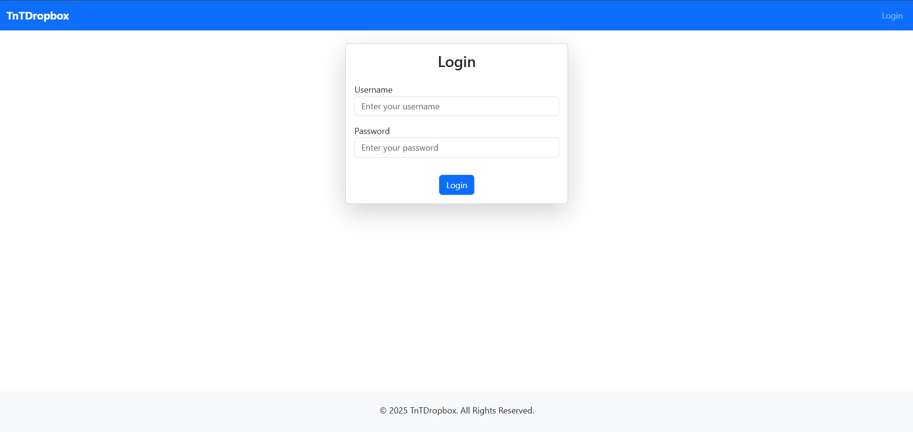
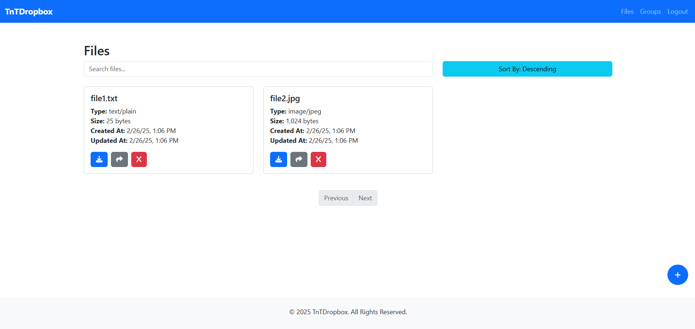
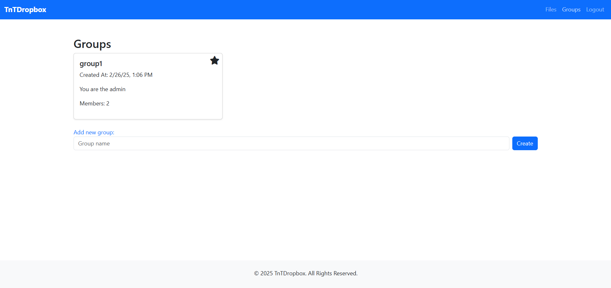
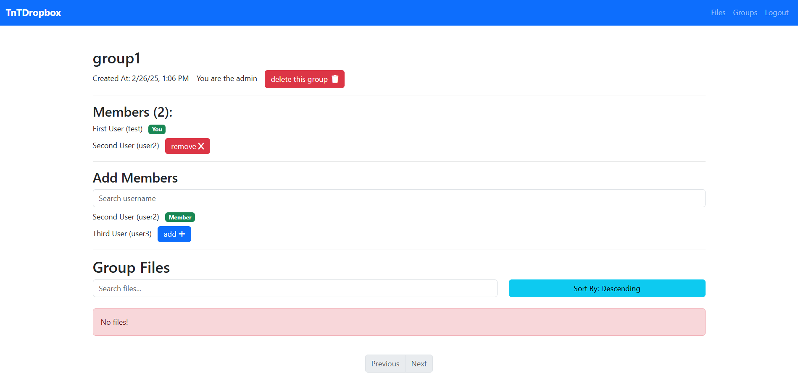

# TnTDropboxFrontend

TnT Dropbox is designed for file storage, sharing, and management in a digital environment. Users can collaborate, track activities, and control access while ensuring availability anytime, anywhere. The application is based on microservices and includes features for file storage, management, notifications, activity tracking, and collaboration.

This repository contains the **frontend** of the TnT Dropbox project.

## Pages

The frontend consists of the following main pages:

- **Login Page (`/login`)**

  - Users can log in to access their files and groups.
  - 

- **Files Page (`/files`)**

  - Displays the user's stored files.
  - Users can upload, download, and manage files.
  - 

- **Groups Page (`/groups`)**

  - Lists user groups for collaboration.
  - Users can create and manage groups.
  - 

- **Group Details Page (`/groups/:id`)**
  - Shows details of a specific group.
  - Users can view shared files and collaborate within the group.
  - 

## Disclaimer

The frontend does **not** implement every feature of the backend.
